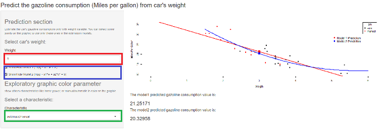

```{r setup, include=FALSE}
knitr::opts_chunk$set(echo = TRUE)
```

## Miles per gallon (MPG) estimation from weight of cars application

- The MPG estimation application was developed using the **Shiny** package with **R** language .

- the next slides present the data (mtcars dataset), the principles of the application, and the links of the application and code 


## The mtcars dataset

The mtcars dataset describes the MPG consumption of 32 cars' models with 11 differents characteristics.

```{r , echo=TRUE}
head(mtcars)
```

The MPG may depend on several variables, but in this application, we decide to compute MPG estimation only from the weight variable (wt). 

## Application Overview

- the application allow to estimate the mpg of a car thanks to two linear models based on the weight precised by user in red (the equations can be found on the UI in blue). The user can select few points on the graph for models estimation. 

- Although others variables are not used in both models, they can be observed in color choosing the characteristic in the exploratory part in green.



## Application and code links

The link of the application:
https://jmtx.shinyapps.io/shiny_pred_mpg/

the link of the code on github:
https://github.com/JMTX/SHINY_APP/tree/gh-pages
